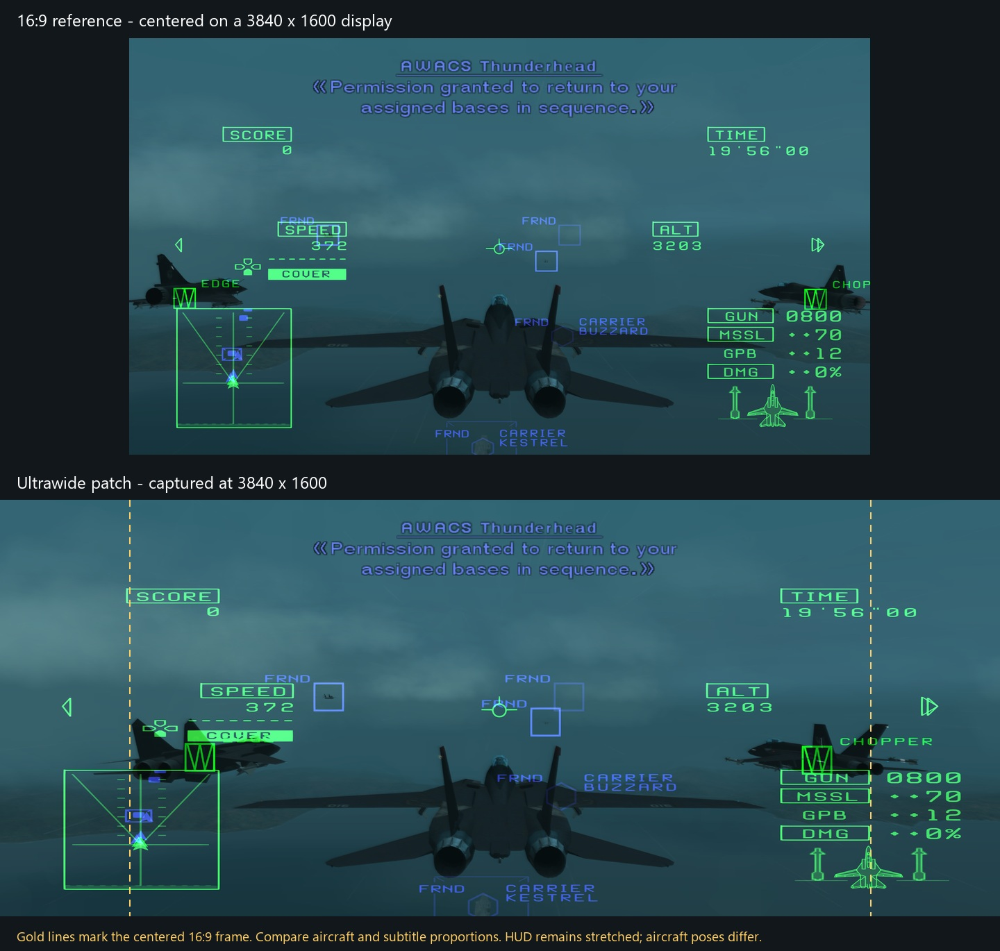

# Ace Combat 5: The Unsung War [SLUS-20851] (NTSC-U) — Ultrawide patches

PCSX2 patches for **SLUS-20851 / CRC 39B574F0**. Use only this game version; addresses are not portable to other regions or executable revisions.

## Choose a version

| Display ratio | Target resolution | Patch |
| --- | --- | --- |
| 12:5 | 3840×1600 | [Download PNACH](12%3B5/SLUS-20851_39B574F0.pnach) |
| 21:9 | 3440×1440 | [Download PNACH](21%3B9/SLUS-20851_39B574F0.pnach) |
| 32:9 | 5120×1440 or 3840×1080 | [Download PNACH](32%3B9/SLUS-20851_39B574F0.pnach) |

The `21;9` folder targets **3440×1440 (43:18)**, not exact 21:9 (7:3) or 2560×1080. Other resolutions with the same actual ratio use the same patch values.

## Reference comparison

## Installation

1. Download **one** matching PNACH from the table and copy it into PCSX2’s **patches** folder. Keep its filename. If you don't already have a custom patch file for this game, you should be good to go. If you do, **DO NOT OVERWRITE** your patch. You will lose whatever is there. Instead, manually copy & paste everything under "gametitle=Ace Combat 5: The Unsung War [SLUS-20851] (NTSC-U)" into your existing file.
2. Enable the matching patch entry in the game’s per-game 'Patches' settings (names below). Installing the file does not automatically enable it or change settings.
3. Disable competing widescreen, ultrawide or camera/FOV patches, including the **Widescreen 16:9** that should come bundled with PCSX2.
4. Select **Fit to Fullscreen / Stretch** for PCSX2’s output aspect ratio. The actual game presentation area must match the chosen ratio, so make sure to fullscreen the game, or the 3D space will look horizontally compressed. Internal rendering resolution can remain at your preferred setting. **Suggestion**: Set the FMV Aspect Ratio Override in PCSX2 Graphics Settings to 'Native' or 'Widescreen', as 4:3 FMVs stretched to ultrawide...don't look good.
5. Fresh boot the game.
6. **CRITICAL**: Set the game’s own screen/aspect option to **16:9** in it's Display Settings. If you installed this patch and it looks wonky, verify this setting in the in-game Display Settings is set to 16:9.

### Patch entries

- **3840×1600:** `True 2.4:1 - 3840x1600`
- **3440×1440:** `Ultrawide - 3440x1440 (43:18)`
- **5120×1440 or 3840×1080:** `Ultrawide - 5120x1440 (32:9)`

## Features and limitations

Corrects supported gameplay camera projection, scripted cutscene projection, and dialogue/radio subtitle proportions. HUD and menus remain stretched; earlier HUD adjustments were removed because they caused artifacts. Pre-rendered movies are not corrected, naturally.
**21:9 and 32:9 have not been tested by me as I do not have monitors with these aspect ratios**. Please let me know if you run into issues with these versions.

## Variant calculations and validation

- Gameplay focal values and virtual height scale together from the tested 2.4:1 calibration.
- Scripted cutscene lens numerator and height use (16/9)/target ratio.
- Subtitle X offsets and applicable clip bounds use signed integer scale 32/43, preserving their centers.
- Subtitle X offsets and applicable clip bounds use signed integer scale 1/2, preserving their centers.

The 3440×1440 and 32:9 versions were derived from the existing 3840×1600 patches. Changed constants, injected full-precision loads and subtitle arithmetic were checked offline; neither new ratio has been visually validated in game. 32:9 specifically may expose geometry or clipping issues.

## Credits

- **Based on nemesis2000’s 16:9 projection calibration.**
- **danyole7:** ultrawide adaptation and testing.
